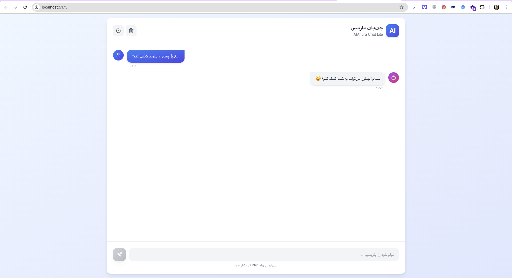
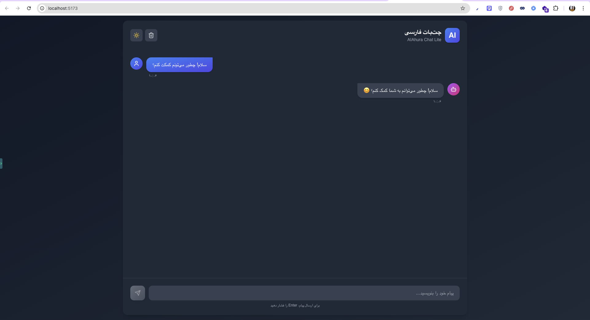
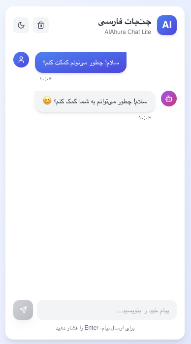

چت‌بات فارسی – AIAhura Chat Lite

یک رابط کاربری ساده، مدرن و واکنش‌گرا برای چت‌بات فارسی با پشتیبانی کامل از RTL، تم تاریک/روشن و قابلیت ارسال/دریافت پیام از API.

✨ ویژگی‌ها

رابط کاربری RTL و کاملاً واکنش‌گرا

ارسال و دریافت پیام از API

نمایش تاریخچه پیام‌ها + اسکرول خودکار

اندیکاتور «در حال تایپ…»

تم تاریک/روشن

ذخیره پیام‌ها در localStorage

مدیریت خطا (شبکه، پاسخ نامعتبر و…)

📸 تصاویر

### حالت روشن (دسکتاپ)

### حالت تاریک (دسکتاپ)

### نمای موبایل

🛠 تکنولوژی‌ها

React 18 – TypeScript – Vite – TailwindCSS (RTL) – Axios – Context API

🚀 نصب سریع
yarn install
yarn run dev

🔌 API
URL: https://chat.aiahura.com/api/v1/chat/completions
API Key: sk-xxxx...
Model: mistral-small3.2:24b

فرمت درخواست
{ "model": "mistral-small3.2:24b", "messages": [{ "role": "user", "content": "سلام" }] }

فرمت پاسخ

پاسخ را از مسیر زیر بخوانید:
choices[0].message.content
